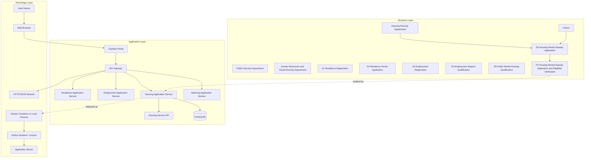

# Role D Deliverable: Three-layer ArchiMate Model

## 1. Purpose

This ArchiMate model describes how CityStart aligns business services, application components, and deployment technologies for the one-stop settlement and employment service platform for new urban residents.

## 2. Business Layer

| Element Type | Element | Description |
|---|---|---|
| Business Actor | Citizen | New urban resident who uses the CityStart platform. |
| Business Actor | Public Security Department | Provides Residence Registration and Residence Permit Application services. |
| Business Actor | Human Resources and Social Security Department | Provides Employment Registration and Employment Support services. |
| Business Actor | Housing Security Department | Provides Public Rental Housing Qualification and Housing Rental Subsidy services. |
| Business Role | Housing Service Reviewer | Reviews housing subsidy applications and verification results. |
| Business Service | S1 Residence Registration Service | Registers a citizen's residence information. |
| Business Service | S2 Residence Permit Application Service | Processes residence permit applications and supplementary documents. |
| Business Service | S3 Employment Registration Service | Registers employment status. |
| Business Service | S4 Employment Support Qualification Service | Assesses employment support eligibility. |
| Business Service | S5 Public Rental Housing Qualification Service | Assesses public rental housing qualification. |
| Business Service | S6 Housing Rental Subsidy Application Service | Processes rental subsidy application and eligibility verification. |
| Business Process | P2 Housing Rental Subsidy Application and Eligibility Verification | Citizen submits housing subsidy application, the platform checks documents, the housing department verifies housing information, employment information is checked, and the final decision is returned. |
| Business Object | Housing Subsidy Application | Application data submitted by a citizen. |
| Business Object | Rental Contract | Document used to prove renting status. |
| Business Object | Employment Verification Result | Cross-service evidence from Employment Service. |
| Business Object | Housing Verification Result | Housing information check result. |

## 3. Application Layer

| Element Type | Element | Description |
|---|---|---|
| Application Component | CityStart Portal | Web entry used by citizens. |
| Application Component | API Gateway | Unified routing, timeout handling, aggregation and response formatting. |
| Application Component | Residence Application Service | Implements S1 and S2 APIs. |
| Application Component | Employment Application Service | Implements S3 and S4 APIs. |
| Application Component | Housing Application Service | Implements S5 and S6 APIs. |
| Application Component | Matching Application Service | Generates recommended service plan. |
| Application Interface | Housing Service API | Exposes application, document, eligibility, verification and status endpoints. |
| Application Service | Housing Eligibility Check | Checks basic eligibility rules for S6. |
| Application Service | Housing Application Management | Creates, retrieves and updates housing subsidy applications. |
| Data Object | housing.db | SQLite database owned by Housing Service. |

## 4. Technology Layer

| Element Type | Element | Description |
|---|---|---|
| Device | User Device | Laptop or mobile browser used by citizen. |
| System Software | Web Browser | Runs the CityStart Portal. |
| Node | Application Server | Runs FastAPI services. |
| System Software | Python Runtime / Uvicorn | Runtime for backend microservices. |
| Node | Database System | SQLite storage for each service. |
| Artifact | housing-service container/process | Deployable artifact for Housing Service. |
| Technology Service | HTTP/JSON Communication | Communication protocol among Portal, Gateway and microservices. |
| Communication Network | Localhost / Docker Network | Local network for the course prototype. |

## 5. Cross-layer Relationships

| Source | Relationship | Target | Explanation |
|---|---|---|---|
| Citizen | uses | S6 Housing Rental Subsidy Application Service | The citizen applies for a rental subsidy. |
| S6 Housing Rental Subsidy Application Service | is realized by | Housing Application Service | Business housing service is implemented as a microservice. |
| P2 Housing Rental Subsidy Application and Eligibility Verification | is supported by | Housing Application Management | The process uses APIs for application creation, document submission, verification and status update. |
| Housing Application Service | exposes | Housing Service API | Gateway and Portal access housing functions through API endpoints. |
| Housing Application Service | accesses | housing.db | Housing application, document and verification records are stored locally. |
| housing-service artifact | is deployed on | Application Server | The service can run as a FastAPI process or Docker container. |
| API Gateway | serves | CityStart Portal | The Portal only calls the Gateway rather than backend services directly. |

## 6. Layered Architecture Diagram

## 7. Business–IT Alignment Explanation

The model aligns the business requirement of housing support with an implementable microservice architecture. At the business layer, S6 represents the public service offered by the Housing Security Department. At the application layer, it is realized by the Housing Application Service and accessed through the API Gateway. At the technology layer, the service is deployed as a FastAPI process or Docker container and stores application data in a dedicated SQLite database. This keeps the housing module cohesive while allowing it to cooperate with the Employment Service for employment verification and the Matching Service for service recommendation.
