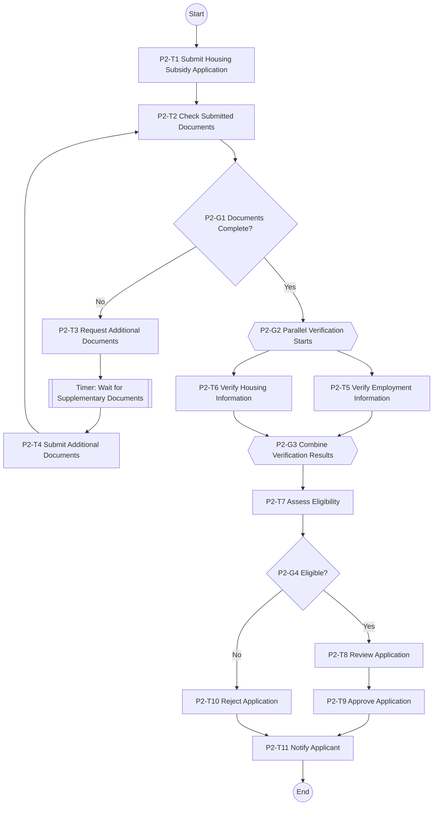

# Role D Deliverable: P2 Housing Rental Subsidy Application and Eligibility Verification BPMN

## 1. Process Scope

P2 covers the housing rental subsidy application and qualification verification process for a new urban resident. The process starts when a citizen submits an application through CityStart and ends when the applicant is notified of approval or rejection.

## 2. Participants

| Pool/Lane | Role |
|---|---|
| Citizen | Submits housing subsidy application and supplementary documents. |
| CityStart Platform | Receives application, checks documents and coordinates service calls. |
| Housing Security Department | Verifies housing information, reviews eligibility and makes the final decision. |
| Employment Information Service | Provides employment registration/verification result to support eligibility checking. |

## 3. Main BPMN Tasks

| BPMN ID | Task | Type | Main Output |
|---|---|---|---|
| P2-T1 | Submit Housing Subsidy Application | User Task | Application submitted |
| P2-T2 | Check Submitted Documents | Service Task | Document completeness result |
| P2-G1 | Documents Complete? | XOR Gateway | Complete / incomplete branch |
| P2-T3 | Request Additional Documents | Service Task | Supplement request sent |
| P2-T4 | Submit Additional Documents | User Task | Additional documents submitted |
| P2-G2 | Start Parallel Verification | Parallel Gateway | Employment and housing checks start |
| P2-T5 | Verify Employment Information | Service Task | Employment verification result |
| P2-T6 | Verify Housing Information | Service Task | Housing verification result |
| P2-G3 | Combine Verification Results | Parallel Gateway | Combined verification record |
| P2-T7 | Assess Eligibility | Service Task | Eligibility result |
| P2-G4 | Eligible? | XOR Gateway | Eligible / not eligible branch |
| P2-T8 | Review Application | Manual/User Task | Review decision |
| P2-T9 | Approve Application | Service Task | Approved status |
| P2-T10 | Reject Application | Service Task | Rejected status |
| P2-T11 | Notify Applicant | Service Task | Notification sent |

## 4. BPMN Flow Diagram

## 5. Official Source to BPMN Mapping

| Official source idea | BPMN element | Modeling decision |
|---|---|---|
| Public rental housing guarantee applicants submit identity and qualification documents to the responsible street/town office or relevant handling channel. | P2-T1 Submit Housing Subsidy Application | In the CityStart prototype, this is simplified as an online application submitted through the Portal. |
| The application is subject to preliminary review and document checking. | P2-T2 Check Submitted Documents / P2-G1 Documents Complete? | Document completeness is modeled before eligibility verification. |
| When documents are incomplete, the applicant should provide additional materials. | P2-T3 Request Additional Documents / P2-T4 Submit Additional Documents | A supplementary document loop is included. |
| Housing security review involves checking housing situation, income/family/property-related conditions and related qualification evidence. | P2-T6 Verify Housing Information / P2-T7 Assess Eligibility | The process checks housing status and subsidy eligibility. |
| For new employment or stable employment groups, employment information and social insurance/employment evidence may be relevant to the qualification review. | P2-T5 Verify Employment Information | The process calls Employment Information Service in parallel with housing information verification. |
| Qualified applications proceed to public/review result and approval; unqualified applications receive rejection and reasons. | P2-G4 Eligible? / P2-T9 Approve Application / P2-T10 Reject Application / P2-T11 Notify Applicant | Final decision and applicant notification are explicitly modeled. |

## 6. Official References Used for Mapping

1. Wuhan Municipal People's Government, *Measures for Public Rental Housing Guarantee in Wuhan*. https://www.wuhan.gov.cn/gwfbpt/szf/whsrmzf/202309/t20230912_2262856.shtml
2. Wuhan Housing and Urban Renewal Bureau, *How can new employees without housing apply for public rental housing guarantee?* https://zgj.wuhan.gov.cn/xxgk/zcfgyjd_1/zcwd/202204/t20220418_1957391.shtml
3. Wuhan public rental housing qualification review process PDF. https://www.jiangxia.gov.cn/xxgk_22343/xxgkml_22349/ggzypz_71067/zfbz/202111/P020211116544230302314.pdf

## 7. Notes on Course Prototype Boundary

CityStart is a course prototype. It does not connect to real government databases and does not process real personal sensitive information. Housing information, employment verification and documents are represented as simulated metadata only.
